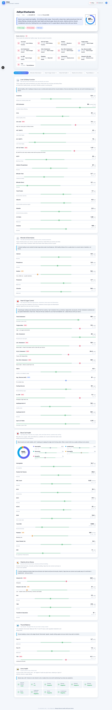
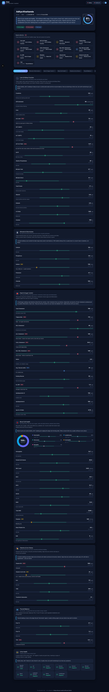
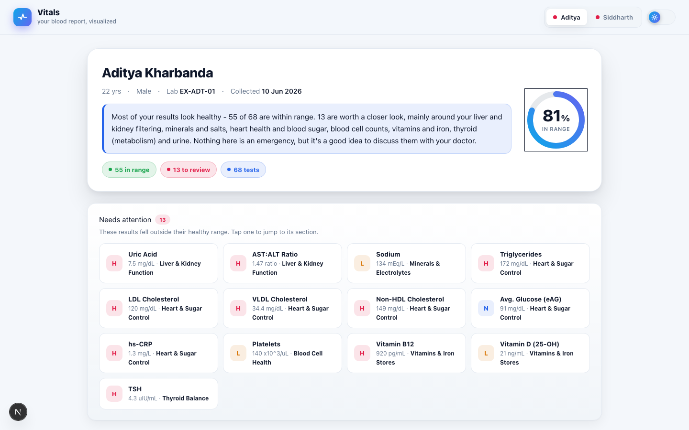
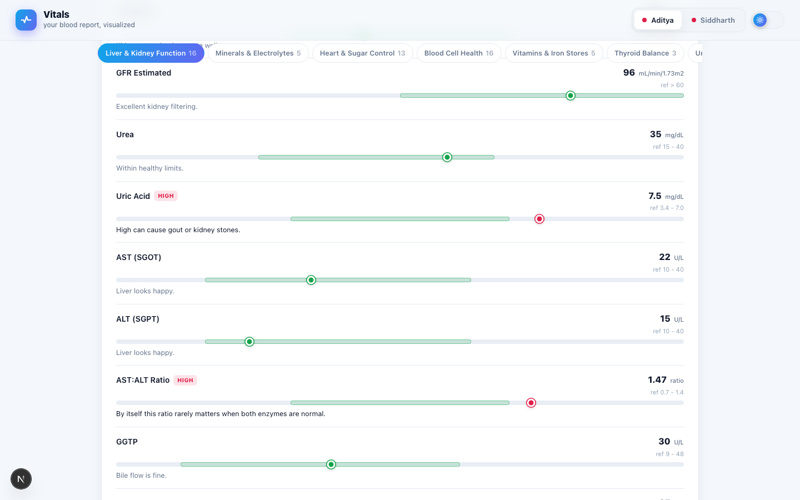
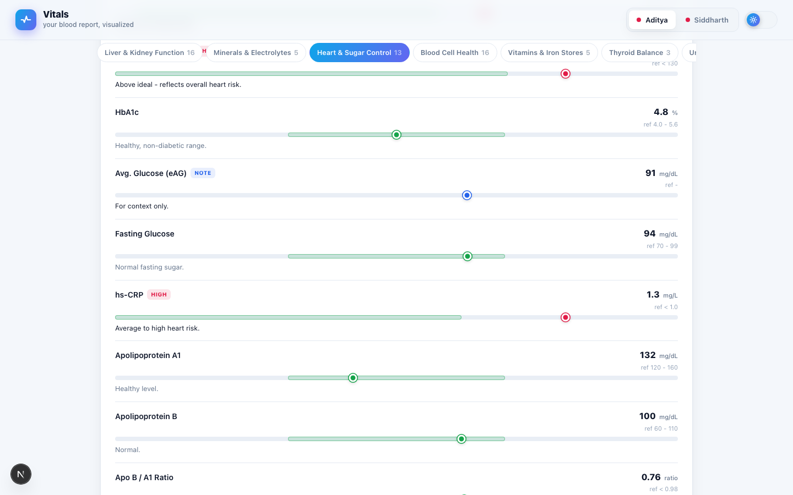

# Vitals — blood test reports, visualized

A weekend project to make blood test reports easier to read. The raw
output from a pathology lab is a wall of numbers, units, and reference
ranges — most people (myself included) skim it, panic at one bold
"high," and never form a clear picture of what's actually going on.

Vitals turns the same report into a story:

- one **wellness ring** per patient (in-range % at a glance)
- seven **narrative sections** (Liver & Kidney, Electrolytes, Heart &
  Sugar, Blood Cells, Vitamins & Iron, Thyroid, Urine) with plain-English
  summaries and a per-test bullet/status chart
- a **patient switcher** for multi-report households
- light / dark theme
- a built-in **example-data mode** so the dashboard can be demoed and
  deployed publicly without exposing real medical data

Disclaimer baked into the footer: _For education only — not a
diagnosis. Always discuss results with your doctor._

---

## How it works

```
private_reports/*.pdf   (pdfplumber)
        │
        ▼
  src/loader.py  ──▶  src/pdf_parser.py  (regex extract)
        │
        ▼
  src/models.py  +  src/ranges.py  (high / low / normal flagging)
  src/interpretations.py          (plain-English notes)
  src/sections.py                (7 narrative groups)
        │
        ▼
  src/exporter.build_document()   (per-test chart scales, JSON)
        │
        ▼
  src/export_json.py  ──▶  next-app/src/data/report.json
                                │
                                ▼
                        Next.js 16 / React 19 dashboard
```

The Python pipeline parses private PDFs and writes a single JSON file.
The Next.js app reads that JSON at build time and renders the entire UI.

## Local development

Requires **Python 3.12+** with [`uv`](https://docs.astral.sh/uv/), and
**Node 20+** for the Next.js app.

```bash
# 1. generate data from the real PDFs (private, not in repo)
uv run python -m src.export_json

#  - or - generate the public example dataset (randomized, no patient data)
VITALS_DATA_MODE=example uv run python -m src.export_json

# 2. run the dashboard
cd next-app && npm install && npm run dev    # http://localhost:3000
```

The Next.js app reads `next-app/src/data/report.json`, which is
**committed** so Vercel can `next build` without Python in the build
environment.

## Deployment

The Next.js dashboard deploys to Vercel. The Python pipeline is not
needed at build time — the committed `report.json` is read directly.

```bash
cd next-app && vercel    # link + deploy
```

### API security — Cloudflare Worker proxy

No API keys live in Vercel environment variables. A Cloudflare Worker
acts as an API proxy: secrets are stored as Worker secrets
(`wrangler secret put KEY_NAME`) and are only visible to the Worker
runtime — never to the browser, source control, or Vercel.

```
Browser → Cloudflare Worker (holds secrets) → upstream API
```

The Worker is in `worker/` with a `/health` endpoint and a
documented `/api/llm` proxy template. CORS is locked to the deployed
origin via `ALLOWED_ORIGIN` in `wrangler.toml`.

```bash
cd worker && wrangler deploy
wrangler secret put TENSORIX_API_KEY   # encrypted, never in code
```

### CI

GitHub Actions (`.github/workflows/ci.yml`) runs on every push/PR to
`main`:

- **Python job**: `uv sync` → `ruff check` → `pytest`
- **Frontend job**: `npm ci` → `eslint` → `tsc --noEmit` → `next build`

## Stack

- **Python**: `pdfplumber`, `uv`
- **Frontend**: Next.js 16, React 19, TypeScript, Tailwind v4,
  framer-motion, next-themes
- **Deployment**: Vercel (dashboard) + Cloudflare Worker (API proxy)
- **CI**: GitHub Actions — Python lint/test + Next.js lint/typecheck/build
- **Tests**: pytest (54 tests covering ranges, models, catalog,
  example-data generation, and loader)

---

## Screenshots

### Light mode — full dashboard



### Dark mode — full dashboard



### Hero — wellness ring & headline



### Section cards — per-test status charts



### Blood cells — WBC donut



---

## Built with

This project was assembled end-to-end with AI tooling in [Zed]:

- **Editor**: [Zed](https://zed.dev)
- **AI coding agent**: [opencode](https://opencode.ai) running inside Zed
- **Inference**: [Tensorix](https://tensorix.ai) (EU/GDPR,
  OpenAI-compatible API). Active model: **`minimax/minimax-m3`**
  (vision-capable). Also configured in the catalog:
  `deepseek/deepseek-v4-flash`, `moonshotai/kimi-k2.5`,
  `z-ai/glm-5.2`, `minimax/minimax-m2`.
- **Memory**: self-hosted [supermemory](https://github.com/supermemory)
  (`localhost:6767`) — storage, embeddings and graph are all local;
  the extraction LLM is routed through Tensorix
  (`scripts/supermemory-tensorix.zsh`).

### MCPs

The agent had access to these MCP servers
(`opencode.json → mcp`):

| MCP                  | Used for                                                    |
| -------------------- | ----------------------------------------------------------- |
| `tavily`             | general web research                                        |
| `brave-search`       | web / image / news / video search                           |
| `context7`           | up-to-date library docs (Next.js, React, etc.)              |
| `design-inspiration` | UI inspiration across Dribbble, Behance, Awwwards, Mobbin   |
| `ui-layouts`         | component-level UI inspiration                             |
| `mcp-copy-web-ui`    | crawl a site and extract design tokens (colors, type, etc.) |
| `github`             | issues, PRs, repo search                                    |
| `vercel`             | Vercel project & deployment management (remote, OAuth)     |

---

## Security note

`private_reports/` contains real blood-test PDFs and is **deny-listed**
at every layer:

- filesystem `.gitignore` (folder is never tracked)
- `opencode.json` deny rules on `read` / `edit` / `glob` / `grep`

The committed `next-app/src/data/report.json` is generated with
`VITALS_DATA_MODE=example` (synthetic data only).

API keys are **never** stored in Vercel environment variables. All
upstream API calls are proxied through a Cloudflare Worker
(`worker/`) whose secrets are set via `wrangler secret put` and are
encrypted at rest — invisible to the browser, source control, and
Vercel.

---

_Made on a weekend. Not medical advice._
